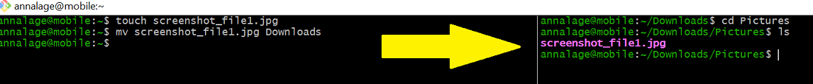
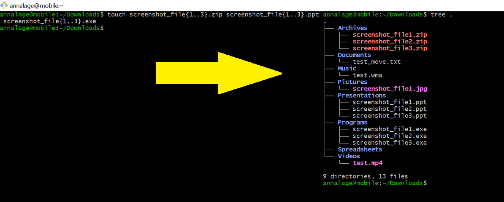
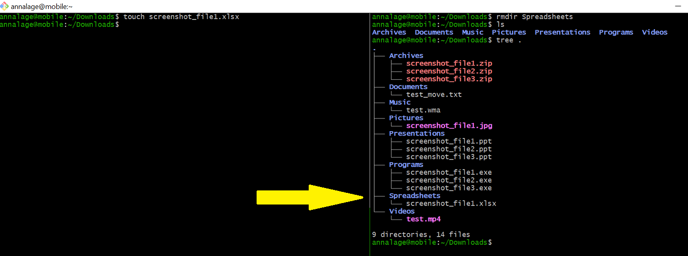

# dlorg_anna_lagerqvist

dlorg monitors the Downloads directory using inotifywait. It is a service that starts automatically after starting the system and works in the backround. When a new file is downloaded or moved to the directory Downloads, the script identifies its file type and automatically moves it to the corresponding folder, such as Documents, Videos, Music etc. 

## How to use dlorg

### 1. Clone the repository into your terminal. 
```bash 
git clone https://github.com/annalagerqvist/dlorg_anna_lagerqvist/
```

### 2. Change the value of the "D" variable to your local Downloads directory path

### 3. Make the dlorg script executable by 
```bash 
chmod u+x dlorg
```  

### 4. Create a symlink for easier changes and shorter paths to the service: 
```bash 
ln -s "$PWD/dlorg" ~/.local/bin/dlorg
```

### 5. Create the systemd service 

Create the service file:

```bash
vim ~/.config/systemd/user/dlorg.service
```

Add the following:
```bash
 [Unit] 
 Description="Starts dlorg on system start to move files to folders in download" 
 After=default.target 
 [Service] 
 Type=simple 
 ExecStart=%h/.local/bin/dlorg 
 [Install] 
 WantedBy=default.target
```

### 6. Reload the user systemd configuration, enable and start the service:
```bash
sudo systemctl daemon-reload
systemctl --user enable dlorg.service
systemctl --user start dlorg.service

```

### 7. The Downloads folder is now monitored automatically.


## Examples of usage:








